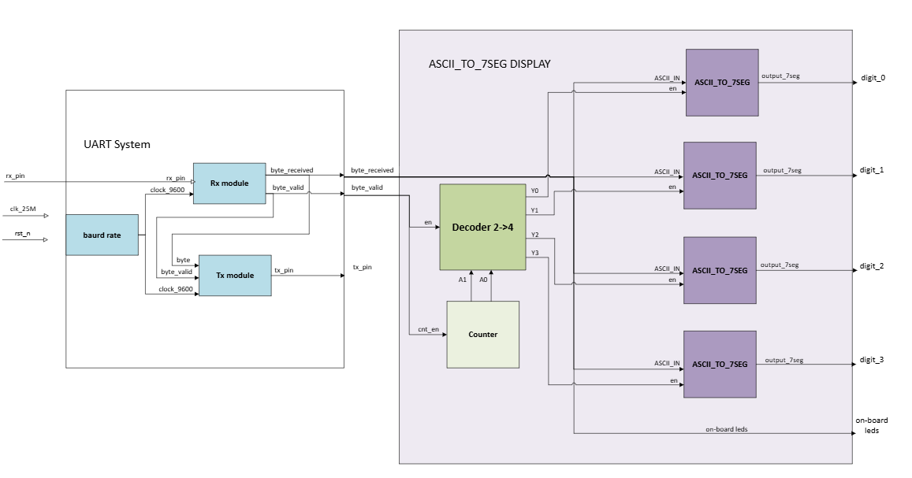
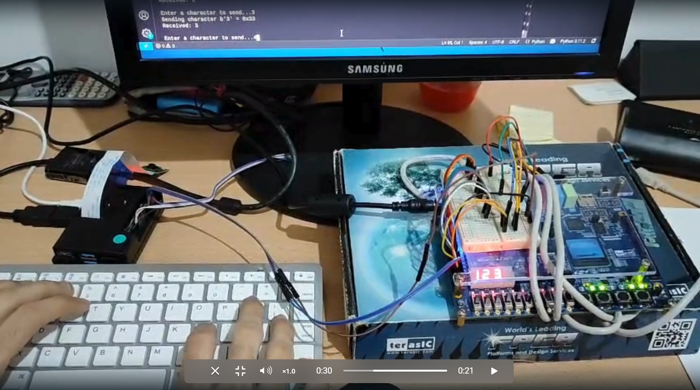

# UART Communication: Raspberry Pi 4 to FPGA (7-Segment)

## 📝 Project Description

This project establishes a robust serial communication link between a **Raspberry Pi 4** and an **FPGA board**. 

A **Python script** running on the Raspberry Pi sends data via **UART**. The FPGA receives this data through a custom-built UART controller and immediately **sends the data back to the Raspberry Pi** to ensure **"Double linked"** (bidirectional) communication and data integrity. Simultaneously, the FPGA decodes the **ASCII characters** to display them in real-time on a **4-digit 7-segment display**. 

This project demonstrates complex hardware-software integration, precise timing for **baud rate generation**, and modular **Verilog design**.

---

## 🖼️ System Visuals

### 1. Block Diagram Architecture
This diagram illustrates the internal logic of the FPGA, including the UART receiver, the decoder, and the 7-segment driver.

<p align="center">
  
</p>

### 2. Running System
The image below shows the hardware setup: The Raspberry Pi 4 monitor sending data and the FPGA board displaying the result.

<p align="center">
  
</p>

---

## 📂 Project Structure

```text
UARTCommunication7Seg/
├── Verilog/
│   ├── sim/                    # Simulation folder
│   │   └── *.do                # ModelSim scripts for testbench automation
│   │
│   ├── src/                    # Verilog Source Files and Testbenches
│   │   ├── uart_controller.v   # Main UART system controller
│   │   ├── uart_controller_tb.v# Testbench for UART controller
│   │   ├── Rx_module.v         # UART Receiver logic
│   │   ├── Rx_module_tb.v      # Testbench for UART Receiver
│   │   ├── Tx_module.v         # UART Transmitter logic
│   │   ├── Tx_module_tb.v      # Testbench for UART Transmitter
│   │   ├── baud_gen.v          # Baud rate generator (timing)
│   │   ├── baud_gen_tb.v       # Testbench for Baud rate generator
│   │   ├── ascii_to_7seg.v     # ASCII to 7-Segment conversion logic
│   │   ├── decoder.v           # System decoder
│   │   └── counter.v           # General purpose counter
│   │
│   └── par/                    # Place and Route (Quartus settings)
│
├── Python/
│   └── UART.py                 # UART Communication script for Raspberry Pi 4
└── README.md
```


## 🎥 Demo Video
You can wach the demonstration video on my Linkedin profile:
https://www.linkedin.com/in/omer-maruani-6a5602271/


